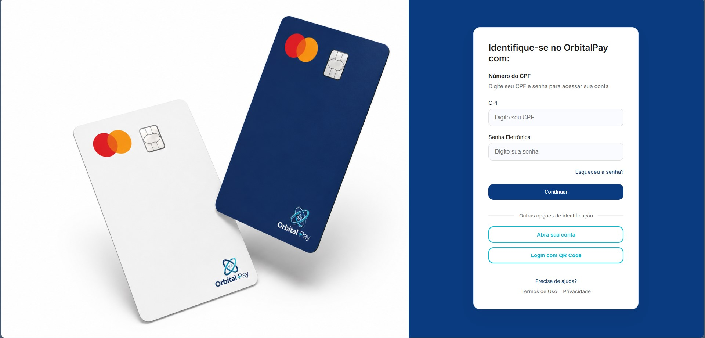
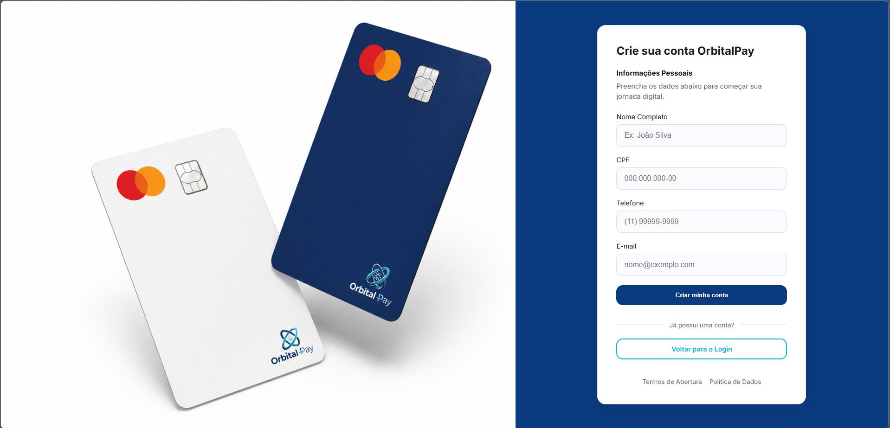
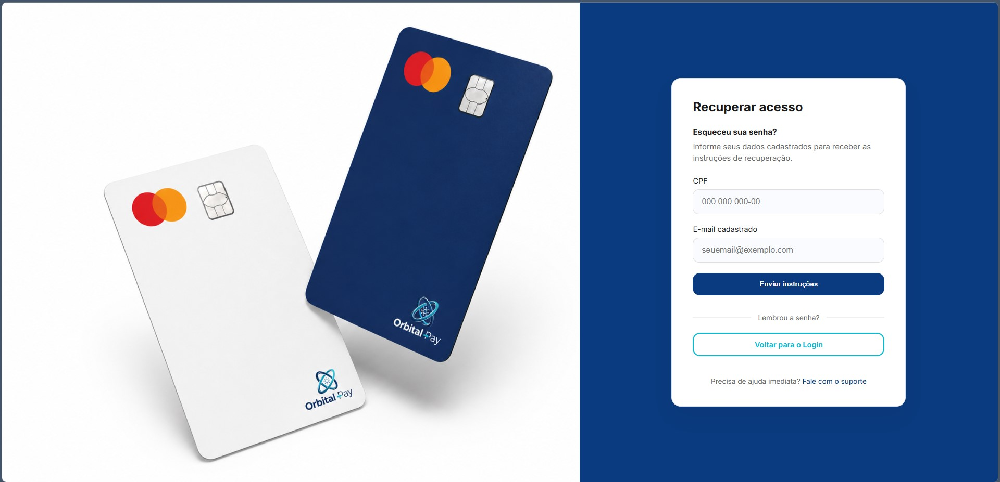

# 🚀 OrbitalPay - Sistema de Banking Digital

O **OrbitalPay** é uma interface de autenticação moderna e responsiva para uma instituição financeira fictícia. O projeto foca em oferecer uma experiência de usuário (UX) fluida, seguindo padrões de design bancário.

---

## 📸 Demonstração do Projeto

Aqui você pode ver o fluxo principal do sistema. As telas foram desenhadas para manter a consistência visual em toda a jornada do usuário.

<table width="100%">
  <tr>
    <td align="center" width="50%">
      <b>Página de Login</b> 
      
    </td>
    <td align="center" width="50%">
      <b>Página de Cadastro</b> 
      
    </td>
  </tr>
  <tr>
    <td align="center" colspan="2">
      <b>Recuperação de Senha</b> 
      
    </td>
  </tr>
</table>

---

## 🛠️ Tecnologias Utilizadas

* **HTML5:** Estruturação semântica.
* **CSS3:** Estilização com variáveis (`:root`), Flexbox e Responsividade.
* **JavaScript:** Máscaras de entrada (CPF/Telefone) e interatividade.

## ✨ Destaques
- ✅ Máscaras de CPF e Telefone em tempo real.
- ✅ Design responsivo (Desktop e Mobile).
- ✅ Identidade visual consistente em todas as telas.

## 🚀 Como Executar
1. Clone o repositório.
2. Abra o `index.html`.

---
*Este projeto foi desenvolvido para fins de estudo e portfólio.*
